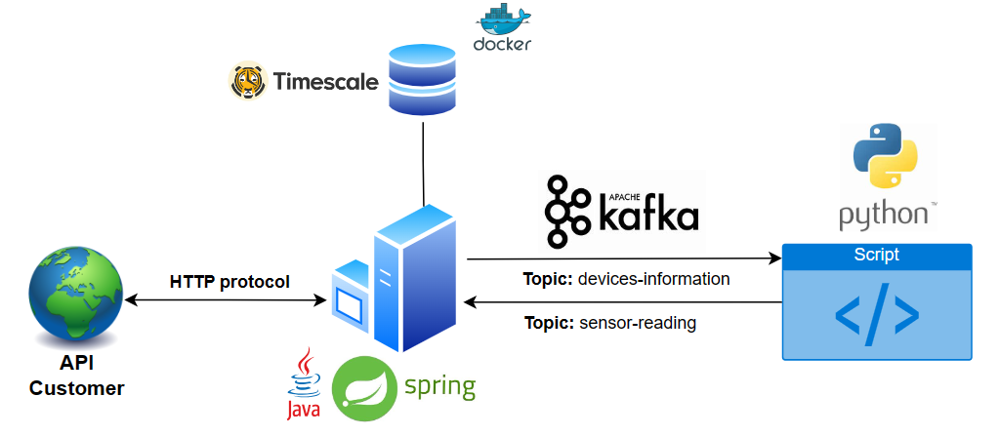
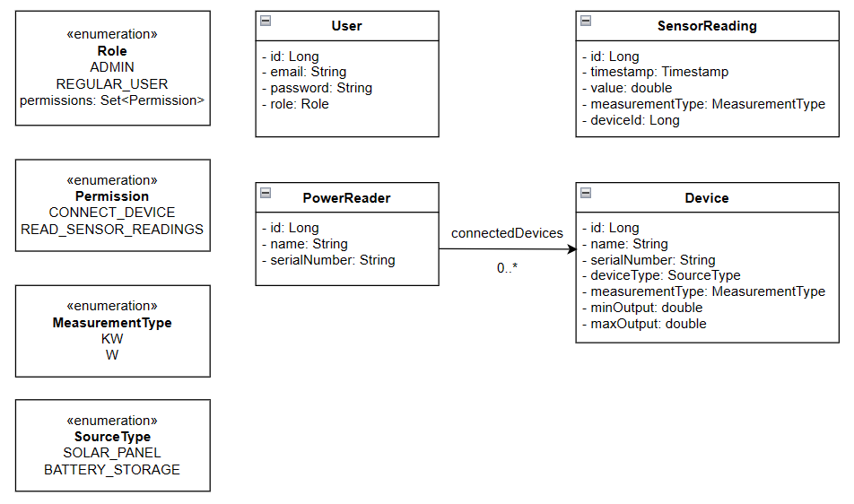
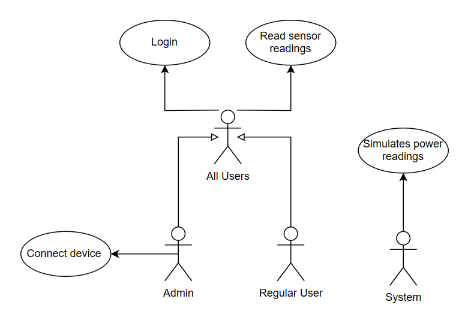

<h1 align="center">
  PowerReaderAPI
   
</h1>

  • <a href="#">Schneider Electric Hub, Novi Sad, 2023</a>
  •
   
  • <a href="#">Software Engineering Internship Project</a>
  •
  <!--  
  • <a href="https://www.youtube.com/watch?v=opQ08rgMkDQ&ab_channel=SrdjanDjuric">Demo Video YT</a>
  • -->

## 👨‍💻 Developer
    • Srđan Đurić           

## 🏗️ Application architecture

## 🖇️ Class diagram

## 💭 Use-case diagram

## 🚀 Project setup

#### :warning: *Pre requirements:*

- JDK version 17
- Docker
- Python version 3.10
- Apache Kafka

#### :floppy_disk: *How to run backend:*

- Open PowerReaderAPI backend app in IntelliJ IDE as Maven project
- Click on reload project(Maven will update and download all dependencies)
- Run DockerDesktop and install TimescaleDB image(https://www.timescale.com/blog/how-to-build-timescaledb-on-docker/)
- Configure paths and username/password for DB in application.properties
- Apache Kafka must be installed and running on the OS
- Click on run button to run server

#### :floppy_disk: *How to run python script:*

- pip install python-kafka
- click on run button in IDE

 

## 🏗️ Project structure:
- BACKEND
    - main
        - java
            - config (project configuration classes)
            - controller (application endpoints are located here)
            - requests (request transfer objects)
            - response (response transfer objects)
            - exception (global exception handler and all exception types)
            - model (all entity classes and enumerations)
            - repository (classes with queries for reaching data from DB)
            - service (all bussines logic)
            - security (security logic)
            - util (helping functions and constants)
        - resources
            - application.properties
            - logback.xml
            - certs(generated public and private keys)
    - test
        - service
            - ServiceTests and TestSuite

## 📎 Useful links:

- TimescaleDB: https://www.timescale.com/
- DockerDesktop: https://www.docker.com/products/docker-desktop/
- Spring Security: https://dev.to/pryhmez/implementing-spring-security-6-with-spring-boot-3-a-guide-to-oauth-and-jwt-with-nimbus-for-authentication-2lhf
- Maven: https://maven.apache.org/
- Apache Kafka: https://kafka.apache.org/
- Srđan Đurić: https://www.linkedin.com/in/srdjan-djuric/
